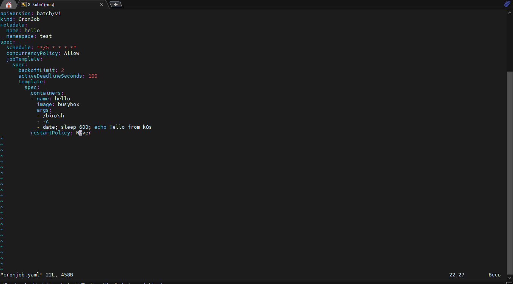
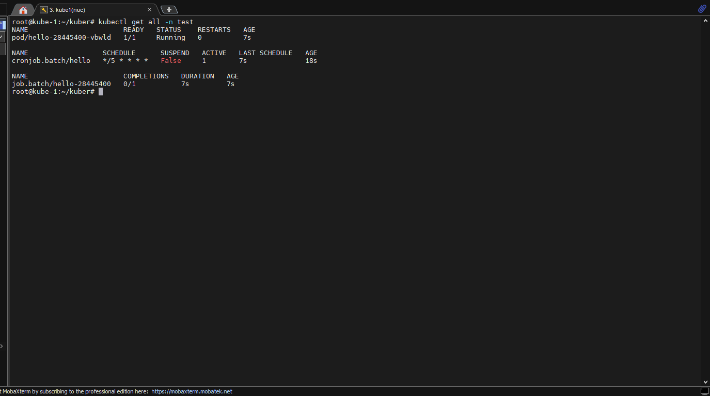
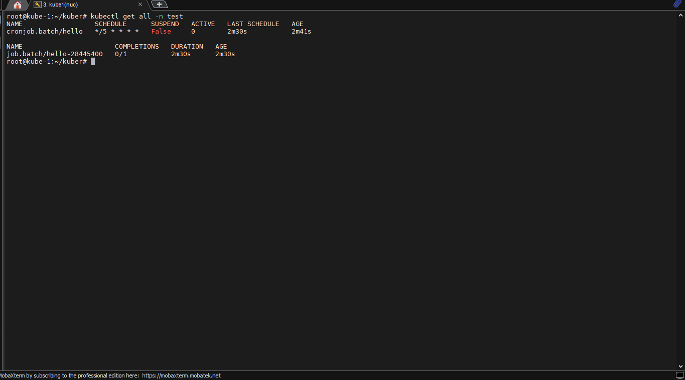
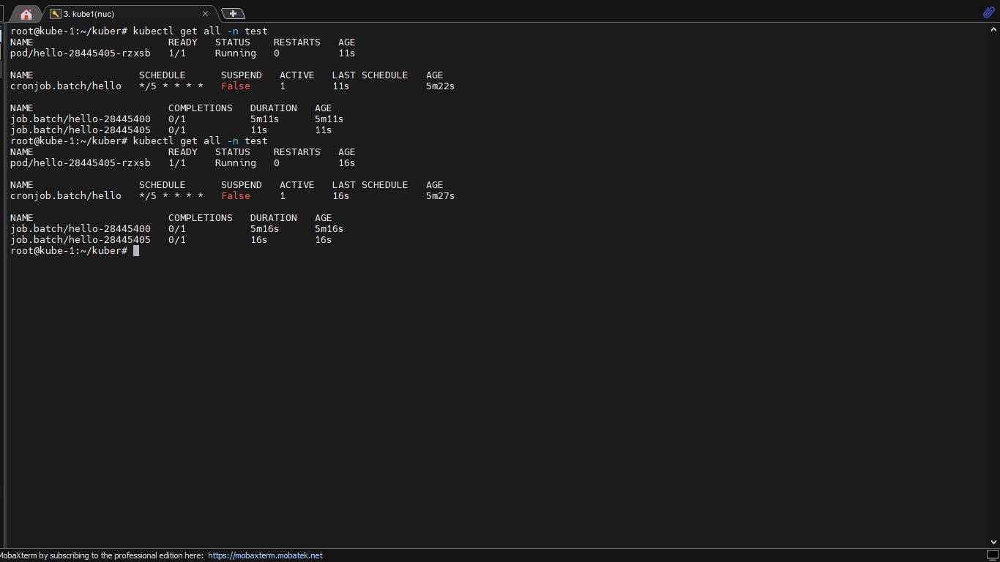
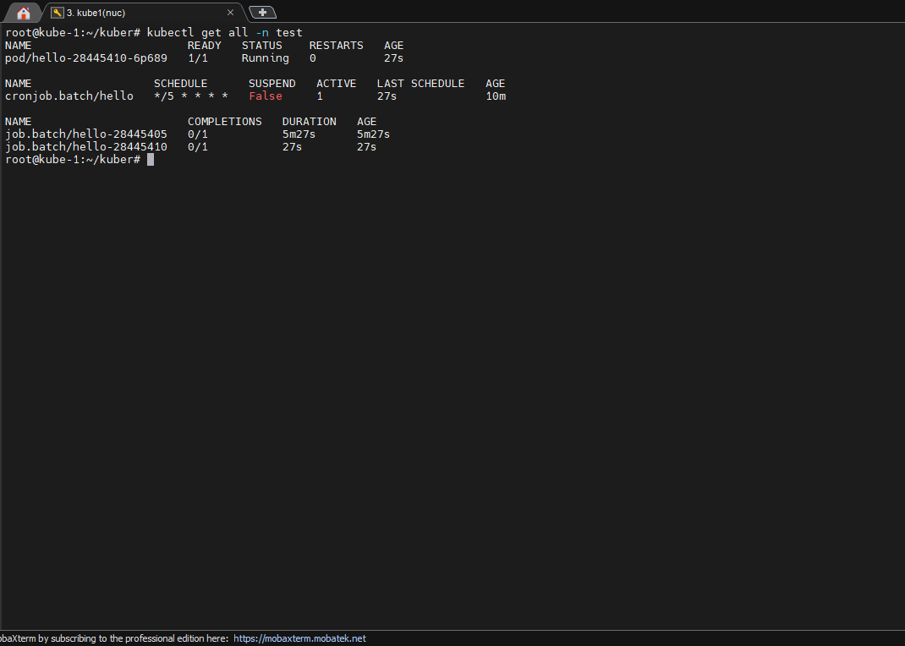
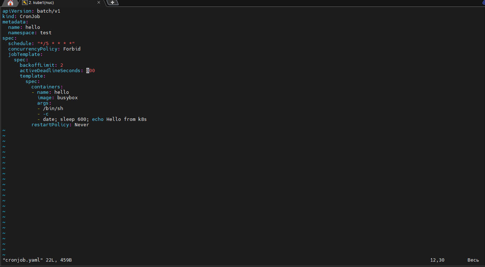
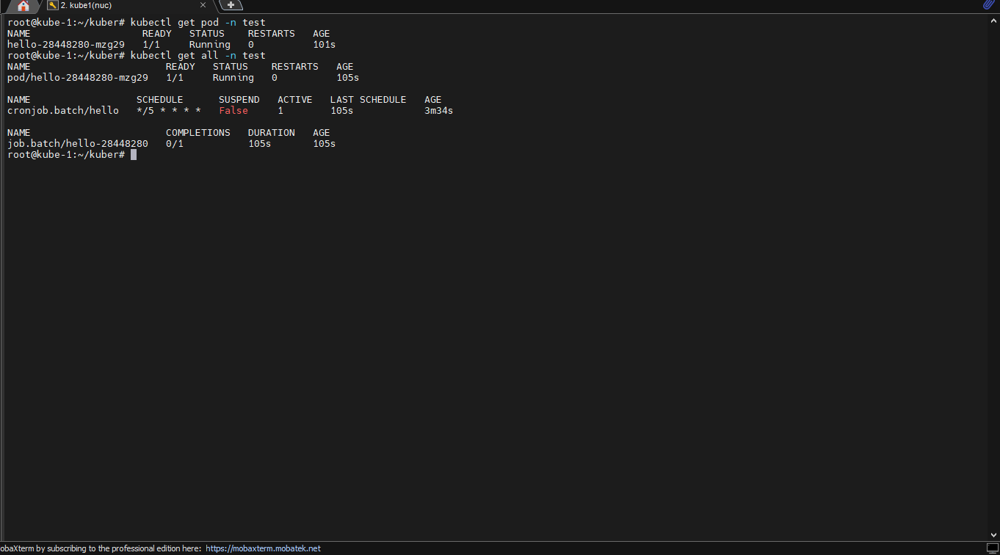
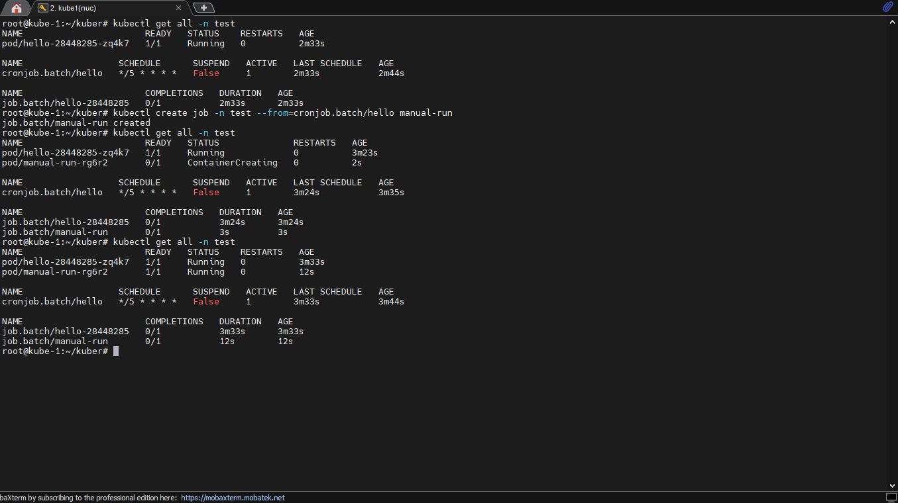

# Создать простой CronJob, с расписанием на выполнение раз в 5 минут. Поставить время выполнения (busybox с sleep 600) 10 минут, чтобы выполнение задачи длилось достаточное количество времени.

## Что нужно сделать:
- Найти способ досрочно запустить запланированную задачу средствами Кубера.
- Удалить любой произвольный запуск CronJob
- Использовать все изученные политики перезапуска в --  CronJob:
    - Allow
    - Forbid
    - Replace.

## 1. Создадим простой CronJob, как указано в задании, взьмем готовый манифест с семинара и немного подправим его, начнем с политики перезапуска Allow

## с помщью команды: *kubectl get all -n* посмотрим что у нас запустилось в просранстве имен test

## так как мы выставили activeDeadlinesecond 100 сек. мы можем увидеть что под удаляется через 100 секунд в то время как job продолжает работу, по истечении 5 мин . запустится новый pod с новым job

## 2. Создадим простой CronJob, как указано в задании, взьмем готовый манифест с семинара и немного подправим его, начнем с политики перезапуска Forbid

## Командой (которой поделился преподователь)) kubectl create job -n test --from=cronjob.batch/hello manual-run досрочно запустим задачу.

